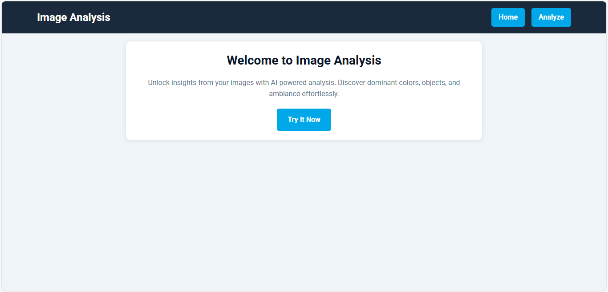
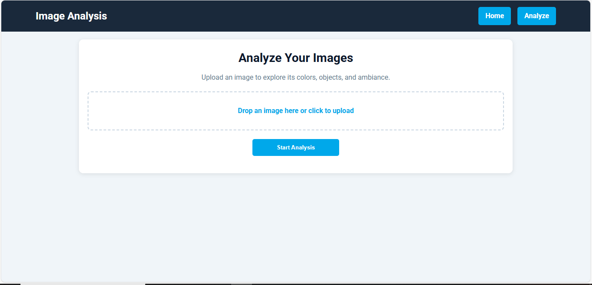
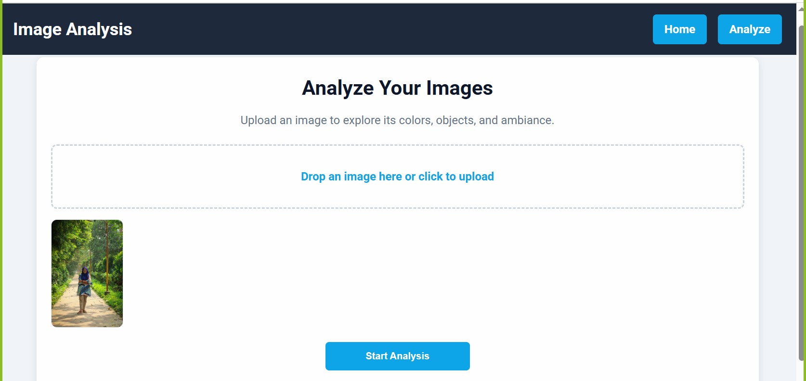
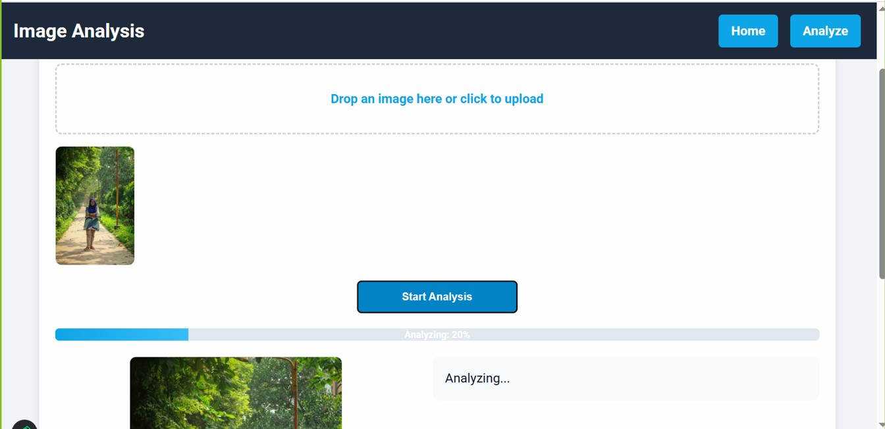
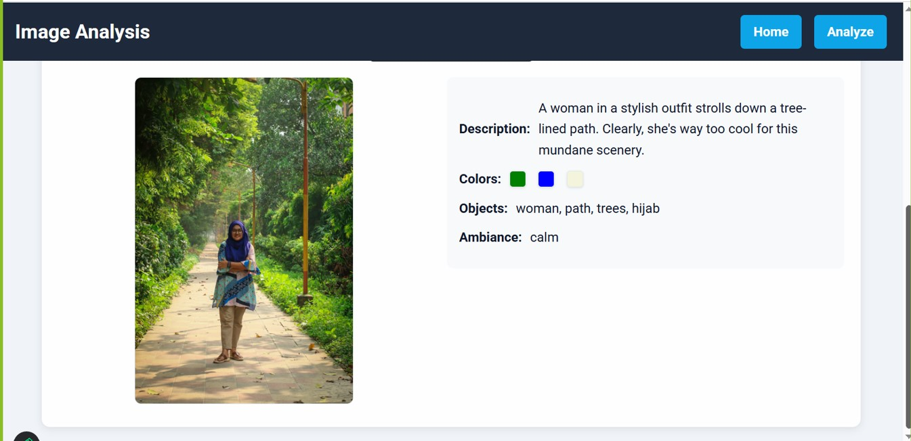

  # Image Description Generator

Welcome to the **Image Description Generator**, a web application that allows users to upload images and analyze them using AI-powered tools. The application provides insights such as dominant colors, detected objects, ambiance, and a brief description of the image.

## Features

- Upload images for analysis.
- AI-powered insights:
  - **Dominant Colors**: Detects the primary colors in the image.
  - **Objects**: Identifies objects present in the image.
  - **Ambiance**: Determines the mood or atmosphere of the image.
  - **Description**: Provides a brief, sarcastic description of the image.
- Responsive and user-friendly interface.

## Screenshots

### Home Page


### Analyze Page


### Uploading an Image


### Analyzing Image


### Result



## Installation

1. Clone the repository:
   ```bash
   git clone https://github.com/anandafc/Image-Description-Generator-AI.git
   cd Image-Description-Generator-AI
   ```

2. Create a virtual environment and activate it:
   ```bash
   python -m venv .venv  
   source .venv/bin/activate  # On Windows: .venv\Scripts\activate
   ```

3. Install dependencies:
   ```bash
   pip install -r requirements.txt
   ```

4. Set up the `.env` file:
   - Add your Gemini API key in the `.env` file:
     ```
     GEMINI_API_KEY = your_api_key_here
     ```

5. Run the application:
   ```bash
   uvicorn app.main:app --reload
   ```

6. Open your browser and navigate to `http://127.0.0.1:8000`.

## Project Structure

```
.
├── .env                  # Environment variables
├── .gitignore            # Git ignore file
├── README.md             # Project documentation
├── requirements.txt      # Python dependencies
├── app/                  # Application source code
│   ├── config.py         # Configuration file
│   ├── main.py           # FastAPI application entry point
│   ├── api/              # API-related code
│   │   ├── gemini.py     # Gemini API integration
│   │   ├── routes.py     # API routes
│   ├── templates/        # HTML templates
│   │   ├── home.html     # Home page template
│   │   ├── analyze.html  # Analyze page template
│   ├── static/           # Static files (CSS, JS, etc.)               

```
## Technologies Used

- **Backend**: FastAPI
- **Frontend**: Jinja2 Templates, HTML, CSS
- **AI Integration**: Google Generative AI (Gemini)
- **Image Processing**: Pillow (PIL)

## Contributing

Contributions are welcome! Please fork the repository and submit a pull request.

## License

This project is licensed under the MIT License. See the `LICENSE` file for details.
